# LLMFS — Filesystem Memory for LLMs and AI Agents

[](https://pypi.org/project/llmfs/)
[](https://www.python.org/downloads/)
[](LICENSE)
[](https://github.com/viditraj/llmfs/actions)

**LLMFS gives LLMs and AI agents persistent, searchable, structured memory — organized like a filesystem.** Instead of losing context when a conversation grows past the token limit, agents offload memories to LLMFS and retrieve exactly what they need, when they need it. The result is zero information loss and an effectively unlimited context window — even over thousands of turns.

---

## Table of Contents

- [Why LLMFS?](#why-llmfs)
- [Quick Start](#quick-start)
- [Architecture](#architecture)
- [Memory Layers](#memory-layers)
- [Feature Comparison](#feature-comparison)
- [Installation](#installation)
- [CLI Reference](#cli-reference)
- [Python API](#python-api)
- [MCP Server (Claude, Cursor, Windsurf)](#mcp-server)
- [LangChain Integration](#langchain-integration)
- [OpenAI Function Calling](#openai-function-calling)
- [Infinite Context — ContextMiddleware](#infinite-context--contextmiddleware)
- [MQL — Memory Query Language](#mql--memory-query-language)
- [Memory Graph](#memory-graph)
- [FUSE Filesystem Mount](#fuse-filesystem-mount)
- [Configuration Reference](#configuration-reference)
- [Examples](#examples)
- [Performance](#performance)
- [Contributing](#contributing)

---

## Why LLMFS?

Every LLM agent eventually hits the same wall: the context window fills up.

The standard solution — lossy summarization — destroys information. When an agent summarizes 80k tokens into 5k, 94% of the detail is gone forever. Ask it about a specific line of code from 30 turns ago, and it can only apologize.

LLMFS takes a different approach, borrowed directly from operating systems:

```
OS Concept     →   LLM Concept
──────────────────────────────────────────────────────────
RAM            →   Context Window (e.g. 128k tokens)
Disk / Swap    →   LLMFS  (500k+ tokens, full fidelity)
Page eviction  →   Offload old turns to LLMFS
Page fault     →   LLM calls memory_search / memory_read
Virtual addr   →   Memory path  (/session/turns/42)
MMU            →   ContextManager
```

Memories are stored at filesystem-style paths (`/projects/auth/bug`, `/events/2026-03-15_fix`) and searched semantically via ChromaDB + `all-MiniLM-L6-v2`. They persist across sessions, support TTLs, carry metadata and tags, and can be linked in a knowledge graph.

---

## Quick Start

```bash
# Install
pip install llmfs

# Initialize a store in the current directory
llmfs init

# Write your first memory
llmfs write /knowledge/hello "LLMFS stores memories at filesystem paths"

# Search it back
llmfs search "how does memory storage work"

# Check what's in the store
llmfs status
```

**Python API in 5 lines:**

```python
from llmfs import MemoryFS

mem = MemoryFS()
mem.write("/projects/auth/bug", "JWT expiry misconfigured at auth.py:45", tags=["jwt", "bug"])
results = mem.search("authentication error", k=3)
print(results[0].path, results[0].score)
```

---

## Architecture



### On-Disk Layout

```
~/.llmfs/            # default; or .llmfs/ in current directory
  metadata.db        # SQLite — file registry, chunks, tags, graph, cache
  chroma/            # ChromaDB persistence — embedding vectors
  config.json        # optional configuration overrides
```

---

## Memory Layers

Every memory belongs to one of four layers with different lifetime semantics:

| Layer        | Purpose                                   | Default TTL       | Use When                                              |
|--------------|-------------------------------------------|-------------------|-------------------------------------------------------|
| `short_term` | Temporary reasoning scratch space         | 60 minutes        | Intermediate calculations, draft thoughts             |
| `session`    | Current conversation context              | Session-scoped    | Turn-by-turn chat, in-progress task state             |
| `knowledge`  | Persistent facts, learnings, code         | Permanent         | Project knowledge, user preferences, decisions        |
| `events`     | Timestamped occurrences                   | Permanent         | Bug reports, deployments, meetings, milestones        |

```python
mem.write("/scratch/step3", "intermediate result", layer="short_term", ttl_minutes=10)
mem.write("/session/task", "refactoring auth module", layer="session")
mem.write("/knowledge/auth/jwt-expiry", "JWT tokens expire after 1h", layer="knowledge")
mem.write("/events/2026-03-15/deploy", "v2.1 deployed to prod", layer="events")
```

Expired `short_term` memories are garbage-collected automatically on each write cycle (throttled to once per minute). Run `llmfs gc` to collect manually.

---

## Feature Comparison

| Feature                        | mem0    | Letta   | ChromaDB  | **LLMFS**        |
|-------------------------------|---------|---------|-----------|------------------|
| Filesystem metaphor            | ✗       | ✗       | ✗         | **✓**            |
| Memory layers with TTL         | Partial | ✓       | ✗         | **✓**            |
| Knowledge graph                | ✗       | ✗       | ✗         | **✓**            |
| Custom query language (MQL)    | ✗       | ✗       | SQL-like  | **Custom MQL**   |
| Auto-compression & chunking    | ✗       | ✓       | ✗         | **✓**            |
| Infinite context (VM model)    | ✗       | ✗       | ✗         | **✓**            |
| CLI interface                  | ✗       | ✓       | ✗         | **✓**            |
| Local-first, no server needed  | ✗       | ✗       | ✓         | **✓**            |
| Zero-config (`llmfs init`)     | ✗       | ✗       | Partial   | **✓**            |
| MCP server built-in            | ✗       | ✗       | ✗         | **✓**            |
| FUSE filesystem mount          | ✗       | ✗       | ✗         | **✓ (optional)** |
| Drop-in agent middleware       | ✗       | ✗       | ✗         | **✓**            |

---

## Installation

### Core (CLI + Python API)

```bash
pip install llmfs
```

**Dependencies (auto-installed):** ChromaDB, sentence-transformers, Click, Rich, scikit-learn, NumPy.

The first `search` or `write` call downloads `all-MiniLM-L6-v2` (~22 MB) to your HuggingFace cache. No GPU required.

### Optional Extras

```bash
# MCP server support (Claude, Cursor, Windsurf, Continue)
pip install "llmfs[mcp]"

# OpenAI function-calling integration
pip install "llmfs[openai]"

# LangChain memory adapters
pip install "llmfs[langchain]"

# FUSE filesystem mount (Linux / macOS only)
pip install "llmfs[fuse]"

# Everything
pip install "llmfs[mcp,openai,langchain,fuse]"

# Development
pip install "llmfs[dev]"
```

### From Source

```bash
git clone https://github.com/viditraj/llmfs.git
cd llmfs
pip install -e ".[dev]"
pytest
```

---

## CLI Reference

All commands accept `--llmfs-path` (or `LLMFS_PATH` env var) to point to a custom store. By default LLMFS looks for `.llmfs/` in the current directory, then falls back to `~/.llmfs`.

### `llmfs init`

Initialize a new store in the current directory.

```bash
llmfs init
# Initialised LLMFS at /your/project/.llmfs
# Next steps:
#   llmfs write /knowledge/hello 'Hello world'
#   llmfs search 'hello'
#   llmfs status
```

### `llmfs write`

Store content at a memory path.

```bash
# From inline content
llmfs write /knowledge/auth/bug "JWT expiry misconfigured at auth.py line 45"

# From a file
llmfs write /knowledge/architecture --file ARCHITECTURE.md

# With layer, tags, and TTL
llmfs write /session/plan "Refactor auth module today" \
    --layer session --tags "plan,auth" --ttl 480

# From stdin
cat report.md | llmfs write /knowledge/report
```

**Options:**
| Flag | Description |
|------|-------------|
| `--layer` | `short_term` \| `session` \| `knowledge` \| `events` (default: `knowledge`) |
| `--tags` | Comma-separated tags, e.g. `"jwt,bug,auth"` |
| `--ttl` | Minutes until auto-expiry |
| `--file` | Read content from a file path |

### `llmfs read`

Read a memory by exact path.

```bash
llmfs read /knowledge/auth/bug

# Focused read: return only chunks relevant to your query
llmfs read /knowledge/auth/bug --query "what line number"
```

### `llmfs search`

Semantic search across all memories.

```bash
llmfs search "authentication error"
llmfs search "bucket creation error" --layer knowledge --tags s3 --k 10
llmfs search "auth bug" --time "last 7 days"
```

**Options:**
| Flag | Description |
|------|-------------|
| `--layer` | Restrict to a layer |
| `--tags` | Comma-separated required tags |
| `--k` | Number of results (default: 5) |
| `--time` | Human time string: `"last 30 minutes"`, `"today"`, `"last 7 days"` |

### `llmfs update`

Modify an existing memory.

```bash
# Append new information
llmfs update /knowledge/auth/bug --append "Fixed in commit abc123"

# Replace content entirely
llmfs update /knowledge/auth/bug --content "Bug resolved. Root cause: missing null check."

# Manage tags
llmfs update /knowledge/auth/bug --tags-add "resolved" --tags-remove "in-progress"
```

### `llmfs forget`

Delete memories.

```bash
# Delete a specific memory
llmfs forget /knowledge/auth/bug

# Wipe an entire layer
llmfs forget --layer short_term

# Delete memories older than a duration
llmfs forget --older-than "30 days"

# Skip confirmation prompt
llmfs forget /session/old-task --yes
```

### `llmfs relate`

Link two memories in the knowledge graph.

```bash
llmfs relate /events/2026-03-15/bug /knowledge/auth/jwt-expiry caused_by
llmfs relate /knowledge/auth/jwt-expiry /knowledge/auth/architecture related_to --strength 0.95
```

### `llmfs query`

Run a structured MQL query.

```bash
llmfs query 'SELECT memory FROM /knowledge WHERE SIMILAR TO "auth bug" LIMIT 5'
llmfs query 'SELECT memory FROM /events WHERE TAG = "deploy" LIMIT 10' --json
```

### `llmfs ls`

List memories under a path prefix.

```bash
llmfs ls /knowledge
llmfs ls /session --layer session
```

### `llmfs status`

Show storage statistics.

```bash
llmfs status
# LLMFS Status  (/home/user/.llmfs)
#   Total memories : 142
#   Total chunks   : 891
#   Disk usage     : 45.2 MB
```

### `llmfs gc`

Garbage-collect expired (TTL) memories and orphaned chunks.

```bash
llmfs gc
# GC complete. Deleted 7 expired memories.
```

### `llmfs serve`

Start the MCP server.

```bash
llmfs serve --stdio          # stdio transport (for Claude, Cursor, etc.)
llmfs serve --port 8765      # SSE transport on port 8765
```

### `llmfs install-mcp`

Auto-configure LLMFS as an MCP server in a supported client.

```bash
llmfs install-mcp --client claude     # Claude Desktop
llmfs install-mcp --client cursor     # Cursor
llmfs install-mcp --client windsurf   # Windsurf
llmfs install-mcp --client continue   # Continue
llmfs install-mcp --print             # Print config JSON to stdout
```

### `llmfs mount` / `llmfs unmount`

Mount LLMFS as a FUSE filesystem (requires `pip install "llmfs[fuse]"`).

```bash
llmfs mount /mnt/memory
llmfs unmount /mnt/memory
```

---

## Python API

```python
from llmfs import MemoryFS

# Initialize — uses ~/.llmfs by default, or .llmfs/ in cwd
mem = MemoryFS()

# Or with a custom path
mem = MemoryFS(path="/tmp/myproject-memory")
```

### `write`

```python
obj = mem.write(
    path="/projects/auth/debug",
    content="User reports bucket creation failure with error: AccessDenied on s3://my-bucket",
    layer="knowledge",          # short_term | session | knowledge | events
    tags=["debug", "s3", "auth"],
    ttl_minutes=None,           # None = permanent; integer = auto-expire
    source="agent",             # manual | agent | mcp | cli
)

print(obj.path)          # /projects/auth/debug
print(obj.layer)         # knowledge
print(obj.chunks)        # list of Chunk objects (auto-chunked + embedded)
print(obj.summaries)     # level_1 (per-chunk) and level_2 (document) summaries
print(obj.metadata.created_at)
```

If you write to the same path with identical content, LLMFS skips re-embedding and returns the cached object immediately.

### `read`

```python
# Full read
obj = mem.read("/projects/auth/debug")
print(obj.content)
print(obj.metadata.tags)
print(obj.relationships)   # linked memories

# Focused read — returns only the chunks most relevant to your query
obj = mem.read("/projects/auth/debug", query="what was the exact error")
print(obj.content)  # only the relevant chunk(s)
```

Raises `MemoryNotFoundError` if the path does not exist.

### `search`

```python
# Basic semantic search
results = mem.search("bucket creation error", k=5)

# With filters
results = mem.search(
    "authentication bug",
    layer="knowledge",
    tags=["jwt"],
    path_prefix="/projects",
    time_range="last 7 days",
    k=10,
)

for r in results:
    print(f"{r.score:.2f}  {r.path}")
    print(f"  {r.chunk_text[:120]}")
    print(f"  tags={r.tags}  layer={r.metadata['layer']}")
```

`search` returns `list[SearchResult]` ordered by descending relevance. Results are cached for 5 minutes (configurable).

### `update`

```python
# Append new findings
mem.update("/projects/auth/debug", append="Fixed in commit abc123. Root cause: null pointer.")

# Full content replacement
mem.update("/projects/auth/debug", content="Completely new content.")

# Tag management only
mem.update("/projects/auth/debug", tags_add=["resolved"], tags_remove=["in-progress"])
```

### `forget`

```python
# Delete a specific memory
result = mem.forget("/projects/auth/debug")
print(result)  # {"deleted": 1, "status": "ok"}

# Wipe a layer
mem.forget(layer="short_term")

# Time-based cleanup
mem.forget(older_than="30 days")
```

### `relate`

```python
result = mem.relate(
    source="/events/2026-03-15/bug",
    target="/knowledge/auth/jwt-expiry",
    relationship="caused_by",   # related_to | follows | caused_by | contradicts
    strength=0.92,              # 0.0 to 1.0
)
print(result["relationship_id"])
```

### `list`

```python
memories = mem.list("/knowledge", recursive=True, layer="knowledge")
for obj in memories:
    print(obj.path, obj.metadata.modified_at)
```

### `query` (MQL)

```python
results = mem.query(
    'SELECT memory FROM /knowledge WHERE SIMILAR TO "auth bug" LIMIT 5'
)
```

### `status`

```python
info = mem.status()
# {
#   "total": 142,
#   "layers": {"knowledge": 98, "events": 31, "session": 11, "short_term": 2},
#   "chunks": 891,
#   "disk_mb": 45.2,
#   "base_path": "/home/user/.llmfs"
# }
```

### `gc`

```python
result = mem.gc()
# {"deleted": 7, "status": "ok"}
```

### Error Handling

```python
from llmfs import (
    MemoryNotFoundError,
    MemoryWriteError,
    LLMFSError,
)

try:
    obj = mem.read("/does/not/exist")
except MemoryNotFoundError as e:
    print(f"Not found: {e}")

try:
    mem.write("/bad", ...)
except MemoryWriteError as e:
    print(f"Write failed: {e}")
```

---

## MCP Server

LLMFS ships a full [Model Context Protocol](https://modelcontextprotocol.io/) server that exposes all six core tools to any MCP-compatible client. Once configured, the LLM can call `memory_write`, `memory_search`, `memory_read`, `memory_update`, `memory_forget`, and `memory_relate` natively in its tool loop.

### Auto-Install (Recommended)

```bash
pip install "llmfs[mcp]"
llmfs install-mcp --client claude    # Claude Desktop
llmfs install-mcp --client cursor    # Cursor
llmfs install-mcp --client windsurf  # Windsurf
llmfs install-mcp --client continue  # Continue
```

This writes or merges the following into your client's config file:

```json
{
  "mcpServers": {
    "llmfs": {
      "command": "llmfs",
      "args": ["serve", "--stdio"],
      "description": "AI memory filesystem — persistent, searchable, graph-linked memory"
    }
  }
}
```

**Config file locations written by `install-mcp`:**

| Client   | Config Path |
|----------|-------------|
| Claude   | `~/Library/Application Support/Claude/claude_desktop_config.json` (macOS) or `~/.config/Claude/claude_desktop_config.json` (Linux) |
| Cursor   | `~/.cursor/mcp.json` |
| Windsurf | `~/.codeium/windsurf/mcp_config.json` |
| Continue | `~/.continue/config.json` |

### Manual Config

Print the config JSON to paste it yourself:

```bash
llmfs install-mcp --print
```

Or with a custom store path:

```bash
llmfs install-mcp --client claude --llmfs-path /my/project/.llmfs
```

### Programmatic Usage

```python
from llmfs import MemoryFS
from llmfs.mcp.server import LLMFSMCPServer

mem = MemoryFS(path="~/.llmfs")
server = LLMFSMCPServer(mem=mem)
server.run_stdio()    # blocking; use as CLI entry-point
# or:
server.run_sse(host="127.0.0.1", port=8765)
```

### The 6 MCP Tools

Once the server is running, the LLM has access to:

| Tool | Description |
|------|-------------|
| `memory_write` | Store content at a path with layer, tags, and optional TTL |
| `memory_search` | Semantic search with layer/tag/time filters |
| `memory_read` | Read a specific memory by exact path (with optional focused query) |
| `memory_update` | Append or replace content; add/remove tags |
| `memory_forget` | Delete by path, layer, or age |
| `memory_relate` | Create a typed, weighted graph edge between two memories |

A system prompt fragment is automatically injected that tells the LLM when and how to use each tool.

---

## LangChain Integration

LLMFS provides two drop-in LangChain memory adapters. Install with `pip install "llmfs[langchain]"`.

### `LLMFSChatMemory` — Persistent Chat History

```python
from llmfs.integrations.langchain import LLMFSChatMemory
from langchain.chains import ConversationChain
from langchain_openai import ChatOpenAI

memory = LLMFSChatMemory(memory_path="~/.llmfs")
chain = ConversationChain(llm=ChatOpenAI(model="gpt-4o"), memory=memory)

# Memory persists automatically — conversations survive process restarts
response = chain.predict(input="What was the JWT bug we discussed?")
```

### `LLMFSRetrieverMemory` — Semantic Context Injection

`LLMFSRetrieverMemory` semantically searches past conversations on every turn and injects the most relevant passages into the LLM's context:

```python
from llmfs.integrations.langchain import LLMFSRetrieverMemory
from langchain.chains import ConversationChain
from langchain_openai import ChatOpenAI

memory = LLMFSRetrieverMemory(
    memory_path="~/.llmfs",
    search_k=5,                   # inject top-5 relevant memories
    layer="knowledge",
)

chain = ConversationChain(llm=ChatOpenAI(model="gpt-4o"), memory=memory)
```

Both classes implement `BaseChatMessageHistory` / `BaseMemory` and work as drop-in replacements for LangChain's built-in memory classes.

---

## OpenAI Function Calling

LLMFS exports OpenAI-format tool definitions and a handler. Install with `pip install "llmfs[openai]"`.

```python
import openai
from llmfs import MemoryFS
from llmfs.integrations.openai_tools import LLMFS_TOOLS, LLMFSToolHandler

mem = MemoryFS()
handler = LLMFSToolHandler(mem)

messages = [
    {"role": "system", "content": "You are a helpful assistant with persistent memory."},
    {"role": "user",   "content": "Remember that our database is PostgreSQL 15."},
]

# Pass LLMFS tools alongside any other tools you use
response = openai.chat.completions.create(
    model="gpt-4o",
    messages=messages,
    tools=LLMFS_TOOLS,
    tool_choice="auto",
)

# Handle all LLMFS tool calls in the response
tool_results = handler.handle_batch(response.choices[0].message.tool_calls)

# Append tool results and continue the conversation
for call, result in zip(response.choices[0].message.tool_calls, tool_results):
    messages.append({
        "role": "tool",
        "tool_call_id": call.id,
        "content": result,
    })
```

`LLMFS_TOOLS` is a plain Python list of JSON Schema dicts — pass it directly to any OpenAI-compatible API.

---

## Infinite Context — ContextMiddleware

The `ContextMiddleware` is LLMFS's flagship feature. Wrap any agent with two lines and get effectively unlimited context with zero information loss.

### The Problem

```
Turn 35: Context window hits 128k tokens
         ↓
  Standard approach: lossy summarization
  128k tokens → 5k tokens = 94% information LOST FOREVER
         ↓
Turn 36: "What was the exact error at auth.py line 45?"
  LLM: "I don't have that detail anymore." ← failure
```

### The LLMFS Solution

LLMFS works like virtual memory. Old turns are evicted from the context window and stored in LLMFS at full fidelity. A compact memory index (≈2k tokens) stays in the system prompt, listing what has been stored and where. When the LLM needs something, it calls `memory_read` or `memory_search` to page it back in.

```
Context Window: 128k tokens
┌──────────────┬──────────────────┬────────────────────────────────┐
│ System       │ Memory Index     │ Active Conversation            │
│ Prompt       │ (~2k tokens)     │ (recent 5–10 turns)            │
│ (~1k)        │ lists paths of   │ (~20–80k tokens)               │
│              │ evicted turns    │                                │
└──────────────┴──────────────────┴────────────────────────────────┘
                       │
               ┌───────▼────────┐
               │    LLMFS       │  500k+ tokens stored, zero lost
               │                │  Full fidelity, semantically indexed
               └────────────────┘
```

### Drop-In Usage

```python
from llmfs import MemoryFS
from llmfs.context import ContextMiddleware

# Wrap your existing agent with 2 lines
agent = YourExistingAgent(model="gpt-4o")
agent = ContextMiddleware(agent, memory=MemoryFS())

# Now every call transparently manages context:
# 1. Intercepts every turn (before + after)
# 2. Scores importance of each message
# 3. Auto-evicts at 70% capacity, targets 50%
# 4. Extracts artifacts (code, errors, file refs) before eviction
# 5. Rebuilds the memory index after eviction
# 6. Injects the index into the system prompt
# 7. Provides memory_search / memory_read tools to the LLM
response = agent.chat("What was the exact error from turn 15?")
```

### Importance Scoring

The middleware scores each turn before evicting the lowest-importance ones:

| Signal | Score Boost |
|--------|------------|
| Contains a code block (` ``` `) | +0.20 |
| Contains error / traceback | +0.20 |
| Contains decision keyword (`decided`, `plan`, `must`) | +0.15 |
| Role = `user` (user intent is high-value) | +0.10 |
| Very recent turn (last 3) | +0.15 |
| Very short / conversational filler | −0.20 |

### Artifact Extraction

Before a turn is evicted, the middleware automatically extracts and stores structured artifacts at dedicated sub-paths:

| Artifact | Stored At | Tags |
|----------|-----------|------|
| Code blocks | `/session/{id}/code/turn_{n}_{i}` | `["code", "<lang>"]` |
| Stack traces / errors | `/session/{id}/errors/turn_{n}` | `["error"]` |
| File paths mentioned | `/session/{id}/files/turn_{n}` | `["file_references"]` |
| Decisions | `/session/{id}/decisions/turn_{n}` | `["decision"]` |
| Full turn (always) | `/session/{id}/turns/{n}` | — |

### Memory Index

The memory index is regenerated after each eviction cycle and injected into the system prompt:

```
## LLMFS Memory Index
You have the following memories (use memory_read / memory_search to retrieve):

- [/session/abc/turns/1]       (turn 1, 10:30) [user]      — User asked to fix auth module bug
- [/session/abc/turns/2]       (turn 2, 10:31) [assistant] — Found JWT expiry at auth.py:45
- [/session/abc/code/turn_2_0] (turn 2, 10:31) [code:py]   — Fixed auth.py token refresh logic
- [/session/abc/errors/turn_3] (turn 3, 10:32) [error]     — TypeError: NoneType at auth.py:45
- [/session/abc/turns/5]       (turn 5, 10:35) [user]      — Asked to also fix refresh endpoint
... (12 more — use memory_search "topic" to find relevant ones)
```

### ContextManager API

For lower-level control:

```python
from llmfs import MemoryFS
from llmfs.context.manager import ContextManager

mem = MemoryFS()
ctx = ContextManager(
    mem=mem,
    max_tokens=128000,
    evict_at=0.70,            # start evicting at 70% capacity
    target_after_evict=0.50,  # evict down to 50%
)

# Track a new turn
ctx.on_new_turn(role="user", content="Fix the JWT bug", tokens=12)
ctx.on_new_turn(role="assistant", content="Found the issue at auth.py:45", tokens=45)

# Get the current memory index for system prompt injection
index = ctx.get_system_prompt_addon()

# Get active (in-context) turns
turns = ctx.get_active_turns()

# Reset for a new session
ctx.reset_session()
```

---

## MQL — Memory Query Language

LLMFS includes a custom query language that compiles to ChromaDB + SQLite queries.

### Syntax

```sql
-- Semantic similarity search in a path prefix
SELECT memory FROM /knowledge WHERE SIMILAR TO "authentication bug" LIMIT 5

-- Tag filter
SELECT memory FROM /knowledge WHERE TAG = "s3" LIMIT 10

-- Combined semantic + tag filter
SELECT memory FROM /knowledge WHERE SIMILAR TO "bucket error" AND TAG = "s3" LIMIT 5

-- Time-scoped search
SELECT memory FROM /events WHERE date > 2026-01-01 AND date < 2026-04-01

-- Topic / keyword filter
SELECT memory FROM /projects WHERE topic = "authentication"

-- Order by recency
SELECT memory FROM /session ORDER BY created_at DESC LIMIT 10

-- Graph traversal (BFS, depth 2)
SELECT memory FROM /projects RELATED TO "/events/2026-03-15/bug" WITHIN 2
```

### Python API

```python
results = mem.query(
    'SELECT memory FROM /knowledge WHERE SIMILAR TO "JWT expiry" AND TAG = "auth" LIMIT 5'
)
for r in results:
    print(r.path, r.score)
```

### CLI

```bash
llmfs query 'SELECT memory FROM /knowledge WHERE SIMILAR TO "auth bug"'
llmfs query 'SELECT memory FROM /events WHERE TAG = "deploy"' --json
```

### Supported Conditions

| Condition | Syntax | Backed By |
|-----------|--------|-----------|
| `SIMILAR TO` | `SIMILAR TO "query string"` | ChromaDB vector search |
| `TAG` | `TAG = "tagname"` | SQLite tag index |
| `date` | `date > 2026-01-01` | SQLite date filter |
| `topic` | `topic = "keyword"` | SQLite metadata filter |
| `RELATED TO` | `RELATED TO "/path" WITHIN N` | Graph BFS traversal |
| `AND` / `OR` | logical combinators | Merged result sets |

---

## Memory Graph

Link related memories to build a navigable knowledge graph.

```python
# Create typed relationships
mem.relate("/events/2026-03-15/bug",     "/knowledge/auth/jwt-expiry",  "caused_by",  strength=0.92)
mem.relate("/knowledge/auth/jwt-expiry", "/knowledge/auth/architecture", "related_to", strength=0.85)
mem.relate("/events/2026-03-14/deploy",  "/events/2026-03-15/bug",      "follows",    strength=1.0)
```

**Relationship types:** `related_to`, `follows`, `caused_by`, `contradicts`

Use graph traversal via MQL:

```sql
SELECT memory FROM /knowledge RELATED TO "/events/2026-03-15/bug" WITHIN 2
```

Or from the Python API via the low-level `MemoryGraph`:

```python
from llmfs.graph.memory_graph import MemoryGraph

graph = MemoryGraph(mem._db)
neighbors = graph.get_neighbors("/knowledge/auth/jwt-expiry")
path      = graph.traverse("/events/2026-03-15/bug", max_depth=3)
```

---

## FUSE Filesystem Mount

Mount LLMFS as a real FUSE filesystem and access memories with ordinary shell tools. Requires Linux or macOS.

```bash
pip install "llmfs[fuse]"
mkdir /tmp/memory
llmfs mount /tmp/memory

# Now you can use standard tools
ls /tmp/memory/knowledge/
cat /tmp/memory/knowledge/auth/jwt-expiry
echo "New finding: also affects refresh endpoint" >> /tmp/memory/knowledge/auth/jwt-expiry

llmfs unmount /tmp/memory
```

**Mount options:**
```bash
llmfs mount /tmp/memory --layer session      # default write layer
llmfs mount /tmp/memory --background         # detach from terminal
```

---

## Configuration Reference

LLMFS works with zero configuration — `llmfs init` is all you need. To tune behavior, create `.llmfs/config.json`:

```json
{
  "embedder": "local",
  "embedder_model": "all-MiniLM-L6-v2",
  "chunk_size_tokens": 256,
  "chunk_overlap_tokens": 50,
  "search_cache_ttl_seconds": 300,
  "auto_relate_threshold": 0.85,
  "context_manager": {
    "max_tokens": 128000,
    "evict_at": 0.70,
    "target_after_evict": 0.50
  },
  "layers": {
    "short_term": { "ttl_minutes": 60 },
    "session":    { "ttl_minutes": null },
    "knowledge":  { "ttl_minutes": null },
    "events":     { "ttl_minutes": null }
  }
}
```

### Configuration Options

| Key | Default | Description |
|-----|---------|-------------|
| `embedder` | `"local"` | `"local"` (sentence-transformers) or `"openai"` |
| `embedder_model` | `"all-MiniLM-L6-v2"` | Model name for local embedder |
| `chunk_size_tokens` | `256` | Target chunk size in tokens (prose); `512` for code |
| `chunk_overlap_tokens` | `50` | Overlap between adjacent chunks |
| `search_cache_ttl_seconds` | `300` | How long to cache search results (0 = disabled) |
| `auto_relate_threshold` | `0.85` | Auto-create `related_to` edge when similarity exceeds this |
| `context_manager.max_tokens` | `128000` | Total context window size (tokens) |
| `context_manager.evict_at` | `0.70` | Fraction of max_tokens at which eviction starts |
| `context_manager.target_after_evict` | `0.50` | Fraction of max_tokens to reach after eviction |
| `layers.short_term.ttl_minutes` | `60` | TTL for `short_term` memories |

### Using OpenAI Embeddings

```json
{
  "embedder": "openai",
  "embedder_model": "text-embedding-3-small"
}
```

```bash
export OPENAI_API_KEY=sk-...
```

OpenAI embeddings are higher quality for some domains but add latency and cost. The local model (22 MB, CPU-only) handles 1,000+ queries/second and is the default.

### Environment Variables

| Variable | Description |
|----------|-------------|
| `LLMFS_PATH` | Override the storage directory (same as `--llmfs-path`) |
| `OPENAI_API_KEY` | Required when using `"embedder": "openai"` |

---

## Examples

### Basic Usage

```python
from llmfs import MemoryFS

mem = MemoryFS()

# Store a few memories
mem.write("/knowledge/db",     "We use PostgreSQL 15 with TimescaleDB extension")
mem.write("/knowledge/auth",   "JWT tokens use HS256, expire in 1 hour")
mem.write("/knowledge/stack",  "Backend: FastAPI + SQLAlchemy. Frontend: Next.js 14")

# Search
results = mem.search("database technology", k=3)
for r in results:
    print(f"[{r.score:.2f}] {r.path}: {r.chunk_text[:80]}")

# Read with a focused query
obj = mem.read("/knowledge/auth", query="what algorithm is used")
print(obj.content)

# Update
mem.update("/knowledge/auth", append="Refresh tokens last 30 days.")

# Link related memories
mem.relate("/knowledge/auth", "/knowledge/db", relationship="related_to")
```

### Agent Memory Across Sessions

```python
from llmfs import MemoryFS

mem = MemoryFS(path="~/.llmfs")

# ── Session 1 ─────────────────────────────────────────────────────────────────
print("=== Session 1 ===")
mem.write("/projects/myapp/auth",
          "Implemented OAuth2 with PKCE. Decided to use Keycloak.",
          tags=["auth", "oauth2", "decision"])

mem.write("/projects/myapp/db",
          "Migrated from MySQL to PostgreSQL 15 on 2026-03-10. "
          "All foreign keys use UUID, not integer IDs.",
          tags=["database", "migration"])

# ── Session 2 (different process, days later) ─────────────────────────────────
print("\n=== Session 2 ===")
mem2 = MemoryFS(path="~/.llmfs")  # same store

results = mem2.search("authentication decisions", layer="knowledge", k=3)
for r in results:
    print(f"  [{r.score:.2f}] {r.path}")
    print(f"  {r.chunk_text[:100]}\n")

# The agent still has the full auth decision from Session 1
obj = mem2.read("/projects/myapp/auth")
print("Auth context:", obj.content[:200])
```

### Codebase Ingestion and Search

```python
import os
from pathlib import Path
from llmfs import MemoryFS

mem = MemoryFS()
src = Path("./src")

# Ingest all Python files
ingested = 0
for py_file in src.rglob("*.py"):
    content = py_file.read_text(errors="replace")
    if len(content.strip()) < 20:
        continue
    # Use relative path as memory path
    mem_path = "/code" + str(py_file).replace(str(src), "").replace("\\", "/")
    mem.write(mem_path, content, layer="knowledge",
              tags=["code", "python"], content_type="python")
    ingested += 1

print(f"Ingested {ingested} files")

# Now search semantically
results = mem.search("database connection pooling", layer="knowledge", k=5)
for r in results:
    print(f"[{r.score:.2f}] {r.path}")

# Or use MQL
results = mem.query(
    'SELECT memory FROM /code WHERE SIMILAR TO "authentication middleware" LIMIT 3'
)
```

### Infinite Context with OpenAI

```python
import openai
from llmfs import MemoryFS
from llmfs.context import ContextMiddleware

mem = MemoryFS()
client = openai.OpenAI()

agent = ContextMiddleware(client, memory=mem, max_tokens=128000)

conversation = []
while True:
    user_input = input("You: ")
    if user_input.lower() == "quit":
        break

    conversation.append({"role": "user", "content": user_input})

    # ContextMiddleware automatically:
    # - Injects the memory index into the system prompt
    # - Evicts old turns to LLMFS when context fills
    # - Makes memory_read / memory_search available as tools
    response = agent.chat(conversation)
    assistant_message = response.choices[0].message.content
    conversation.append({"role": "assistant", "content": assistant_message})
    print(f"Assistant: {assistant_message}")

# Session statistics
stats = agent.get_context_stats()
print(f"\nTurns evicted: {stats['evicted_turns']}")
print(f"Cache hits:    {stats['cache_hits']}")
print(f"Token usage:   {stats['current_tokens']} / {stats['max_tokens']}")
```

### Multi-Agent Shared Memory

```python
from llmfs import MemoryFS

# Both agents share the same store
shared_mem = MemoryFS(path="/tmp/shared-project")

def planner_agent(task: str) -> str:
    """Agent 1: Plans the task and stores its findings."""
    plan = f"Plan for '{task}': 1. Analyze requirements, 2. Design schema, 3. Implement"
    shared_mem.write(
        f"/session/plans/{task.replace(' ', '_')}",
        plan,
        layer="session",
        tags=["plan", "planner"],
    )
    return plan

def executor_agent(task: str) -> str:
    """Agent 2: Reads the plan and executes it."""
    # Search for relevant plans and context
    plans = shared_mem.search(f"plan for {task}", layer="session", k=3)
    knowledge = shared_mem.search(f"{task} patterns", layer="knowledge", k=5)

    context = "\n".join([r.chunk_text for r in plans + knowledge])
    return f"Executing with context:\n{context[:500]}..."

# Agents collaborate via shared memory
plan = planner_agent("build user authentication")
result = executor_agent("build user authentication")
print(result)
```

---

## Performance

Targets on commodity hardware (no GPU):

| Operation | Target | Notes |
|-----------|--------|-------|
| Write (single memory, ~500 tokens) | < 200 ms | Includes chunking + embedding |
| Search (10k memories, top-5) | < 100 ms | Cached repeat queries in < 1 ms |
| Read (by path) | < 10 ms | SQLite lookup + chunk assembly |
| MQL query | < 200 ms | Parse + search |
| Context eviction (20 turns) | < 500 ms | Includes artifact extraction |

**Why it's fast:**
- `all-MiniLM-L6-v2` runs at 1,000+ queries/second on CPU
- SQLite WAL mode allows concurrent reads
- Search results are cached for 5 minutes (SHA256-keyed)
- Content hash check skips re-embedding unchanged content
- ChromaDB uses an HNSW index for sub-linear search

---

## Contributing

Contributions are welcome! LLMFS is an early-stage project and the best areas for contribution are listed below.

### Getting Started

```bash
# Fork and clone
git clone https://github.com/viditraj/llmfs.git
cd llmfs

# Create a branch
git checkout -b feature/my-improvement

# Install in editable mode with dev dependencies
pip install -e ".[dev,mcp,openai,langchain]"

# Run the test suite
pytest --cov=llmfs --cov-report=term-missing

# Run linting
ruff check llmfs/ tests/
```

### Running Tests

```bash
# All tests
pytest

# Specific module
pytest tests/test_filesystem.py -v

# With coverage report
pytest --cov=llmfs --cov-report=html
open htmlcov/index.html

# Fast: skip slow embedding tests
pytest -m "not slow"
```

### Project Structure

```
llmfs/
├── llmfs/
│   ├── __init__.py           # Public API: MemoryFS, MemoryObject, SearchResult
│   ├── core/
│   │   ├── filesystem.py     # MemoryFS — single entry point for all operations
│   │   ├── memory_object.py  # MemoryObject, SearchResult, Chunk dataclasses
│   │   ├── memory_layers.py  # MemoryLayer enum, TTL logic
│   │   └── exceptions.py     # Typed exception hierarchy
│   ├── embeddings/
│   │   ├── base.py           # EmbedderBase abstract class
│   │   ├── local.py          # SentenceTransformer (all-MiniLM-L6-v2)
│   │   └── openai.py         # OpenAI text-embedding-3-small
│   ├── storage/
│   │   ├── vector_store.py   # ChromaDB wrapper
│   │   └── metadata_db.py    # SQLite wrapper (WAL mode)
│   ├── compression/
│   │   ├── chunker.py        # Adaptive chunker: code (AST) vs prose (headers)
│   │   └── summarizer.py     # TF-IDF extractive summarizer
│   ├── retrieval/
│   │   ├── engine.py         # Hybrid retrieval (semantic + temporal + graph)
│   │   └── ranker.py         # Score fusion, recency boost, MMR diversity
│   ├── graph/
│   │   └── memory_graph.py   # Relationship CRUD + BFS/DFS traversal
│   ├── query/
│   │   ├── parser.py         # MQL tokenizer + AST builder
│   │   └── executor.py       # AST → ChromaDB + SQLite
│   ├── context/
│   │   ├── manager.py        # ContextManager — virtual memory manager
│   │   ├── importance.py     # Importance scoring (0–1)
│   │   ├── extractor.py      # Artifact extraction before eviction
│   │   ├── index_builder.py  # Memory index (~2k tokens)
│   │   └── middleware.py     # Drop-in ContextMiddleware
│   ├── mcp/
│   │   ├── server.py         # MCP server (stdio + SSE)
│   │   ├── tools.py          # 6 tool handlers
│   │   └── prompts.py        # System prompt for LLMs
│   ├── cli/
│   │   ├── main.py           # Click entry point
│   │   └── commands.py       # All CLI command implementations
│   └── integrations/
│       ├── langchain.py      # LangChain adapters
│       ├── openai_tools.py   # OpenAI function-calling definitions
│       └── fuse_mount.py     # Optional FUSE mount
├── tests/
│   ├── test_filesystem.py
│   ├── test_embeddings.py
│   ├── test_storage.py
│   ├── test_retrieval.py
│   ├── test_compression.py
│   ├── test_graph.py
│   ├── test_query.py
│   ├── test_context.py
│   ├── test_mcp.py
│   └── test_cli.py
├── examples/
│   ├── basic_usage.py
│   ├── agent_memory.py
│   ├── code_search.py
│   ├── infinite_context.py
│   ├── multi_agent.py
│   ├── langchain_agent.py
│   ├── openai_agent.py
│   └── mcp_config.json
├── pyproject.toml
└── README.md
```

### Areas for Contribution

- **New embedders** — Add adapters for Cohere, Mistral, or local Ollama models
- **Retrieval improvements** — Better score fusion, BM25 hybrid, cross-encoder reranking
- **MQL extensions** — Additional condition types, subqueries, aggregations
- **Graph algorithms** — PageRank-based memory importance, community detection
- **Streaming support** — Streaming writes for real-time transcript ingestion
- **Async API** — `AsyncMemoryFS` for use in async agents and servers
- **Windows FUSE** — WinFsp-based FUSE mount for Windows
- **UI** — A web dashboard for browsing and editing memories

### Submitting a Pull Request

1. **Fork** the repository and create a feature branch from `main`
2. **Write tests** for any new behavior — we target 90%+ coverage
3. **Run the full suite** — `pytest && ruff check .`
4. **Update the README** if you're adding a user-facing feature
5. **Open a PR** with a clear description of what the change does and why

### Reporting Issues

Use the [GitHub issue tracker](https://github.com/viditraj/llmfs/issues). For bugs, please include:
- LLMFS version (`pip show llmfs`)
- Python version
- OS
- Minimal reproduction script

---

## License

[MIT](LICENSE) — free for commercial and personal use.

---

## Acknowledgements

LLMFS stands on the shoulders of:
- [ChromaDB](https://www.trychroma.com/) — embedded vector store
- [sentence-transformers](https://www.sbert.net/) — local embedding models
- [MCP](https://modelcontextprotocol.io/) — Model Context Protocol SDK
- [Click](https://click.palletsprojects.com/) — CLI framework
- [Rich](https://rich.readthedocs.io/) — terminal output formatting
